## CAD Tools
[TOC]
### Open source 
#### GUI
##### FreeCAD
[Site](https://www.freecadweb.org/)
[Github](https://github.com/FreeCAD/FreeCAD)

##### Inkscape
[Site](https://inkscape.org/)
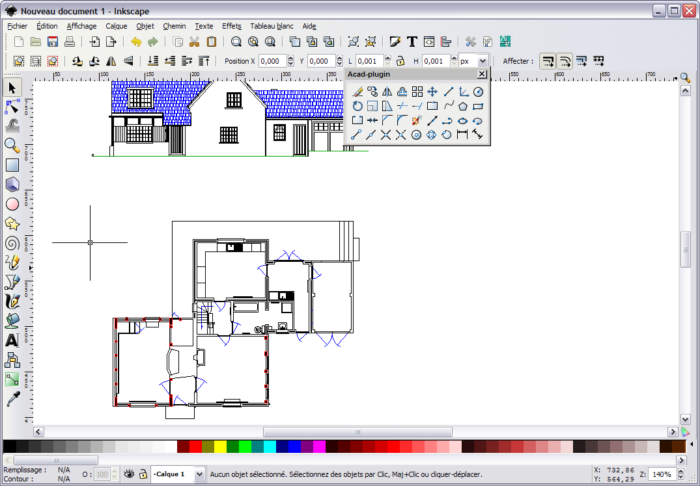

##### QCAD
[Site](https://www.qcad.org/en/)

##### LibreCAD
[Site](https://librecad.org/)
[Github](https://github.com/LibreCAD/LibreCAD/)
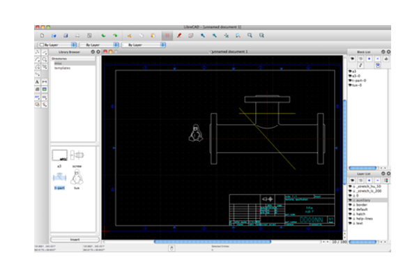

##### Blender + CAD plugin
[Site](https://www.blender.org/)
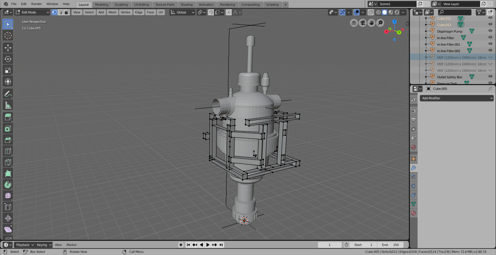

##### Solvespace
[Site](http://solvespace.com/index.pl)
[Github](https://github.com/solvespace/solvespace)
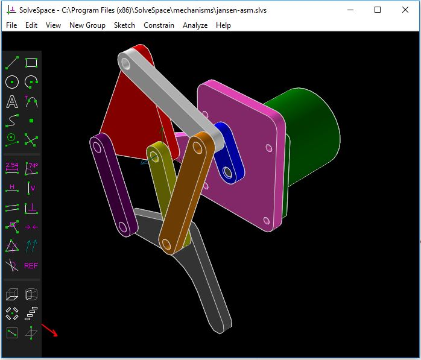

#### BRL-CAD
[Site](https://brlcad.org/)
[Repository](https://sourceforge.net/projects/brlcad/files/)
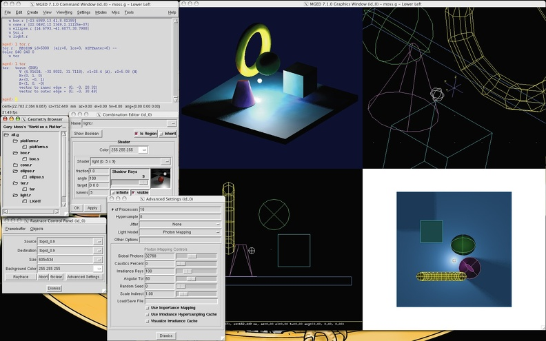

#### NoteCAD
[Site](http://notecad.xyz/)
[Github](https://github.com/NoteCAD/NoteCAD)
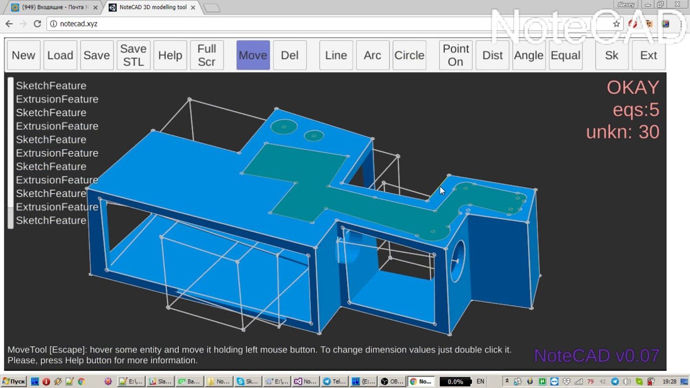

#### SteamCAD
[Github](https://github.com/oskardolch/SteamCAD)

#### Antimony
[Site](http://www.mattkeeter.com/projects/antimony/3/)
[Github](https://github.com/mkeeter/antimony)
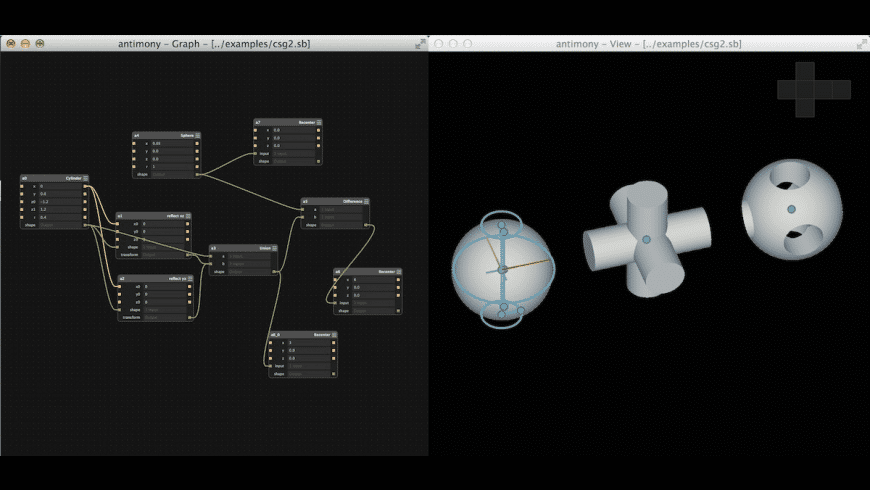

#### gCAD3D
[Site](http://www.gcad3d.org/)
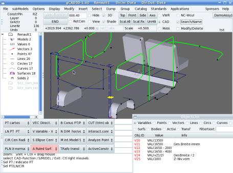

#### LibreDWG
[Github](https://github.com/LibreDWG/libredwg)
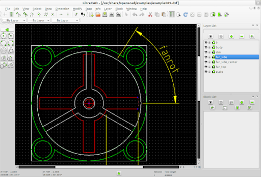

#### LeoCAD
A CAD program for creating virtual LEGO models.
[Site](https://www.leocad.org/)
[Github](https://github.com/leozide/leocad)

#### Script based
##### CadQuery
[Github](https://github.com/dcowden/cadquery)
[Documentation](https://cadquery.readthedocs.io/en/latest/)

##### OpenSCAD
[Site](https://www.openscad.org/)
[Github](https://github.com/openscad/openscad/)
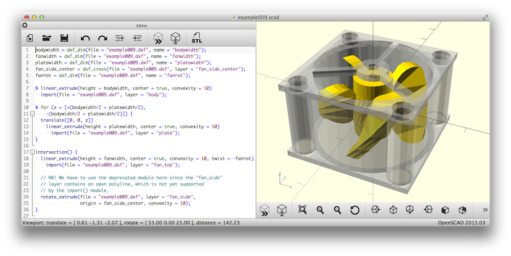

##### OpenJSCAD
[Site](https://openjscad.org/)
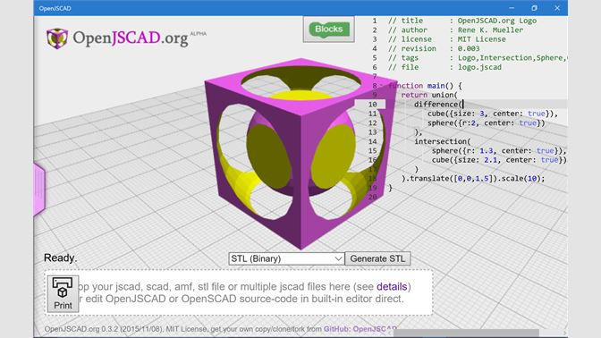

##### Bowlerstudio
[Site](https://commonwealthrobotics.com/)
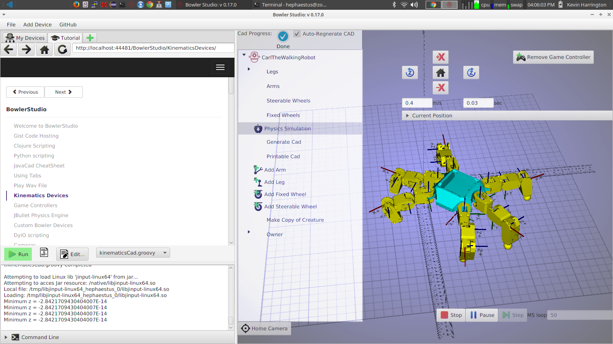

##### Maker.js
[Site](https://maker.js.org/)
[Github](https://github.com/Microsoft/maker.js)

### Proprietary Software
#### Online
##### Onshape

##### Fusion 360 in Browser

##### Tinkercad

