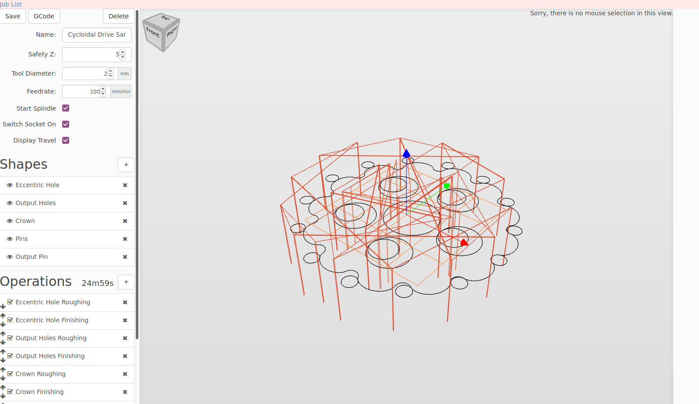

## CAM Tools to generate G-Code
[TOC]
### Browser based
#### Kiri:Moto
Kiri:Motor is an all around tool you can use for 3D printing, CNC toolpath generation and Laser cutting & stacking.
[Site](https://grid.space/kiri/)
[Github repository](https://github.com/GridSpace/grid-apps)
[tutorials](https://www.youtube.com/c/gridspace)

#### visuCAM
[Site](http://nraynaud.github.io/webgcode/webapp/visucamTest.html)

### Application based
#### Slic3r
[Site](https://slic3r.org/)
[Github repository](https://github.com/slic3r/Slic3r)

#### Prusa slicer
[Site](https://www.prusa3d.com/prusaslicer/)
[Github repository](https://github.com/prusa3d/PrusaSlicer)

#### Octoprint
[Site](https://octoprint.org/)
[Github repository](https://github.com/OctoPrint/OctoPrint)

#### Kissslicer
[Site](http://www.kisslicer.com/)

#### icesl
[Site](https://icesl.loria.fr/)
