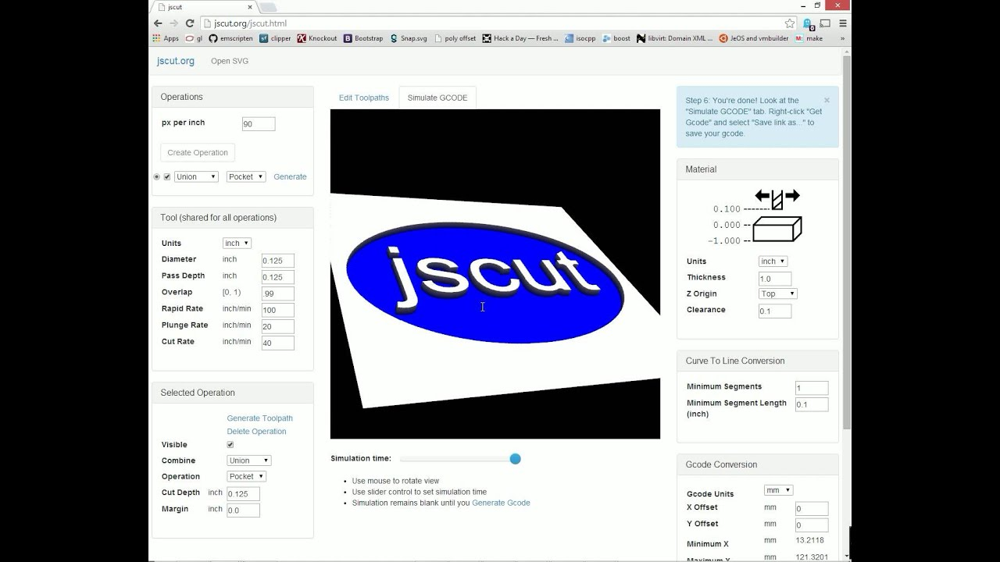
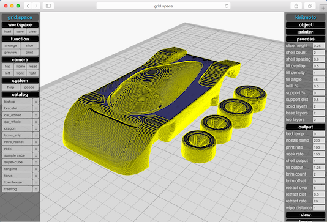
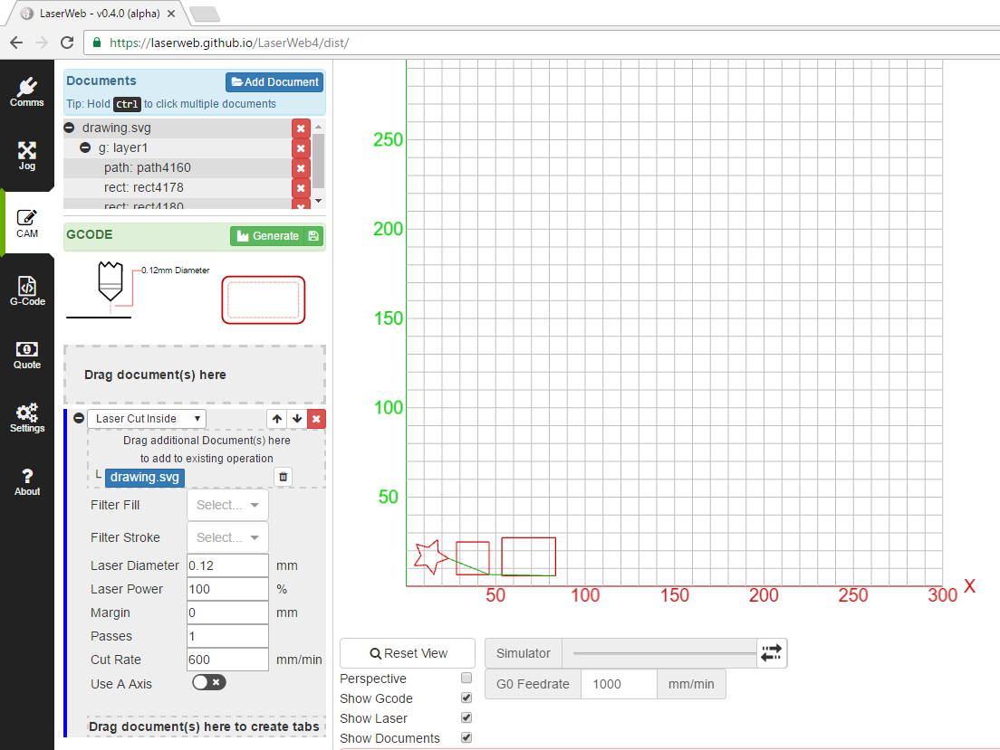
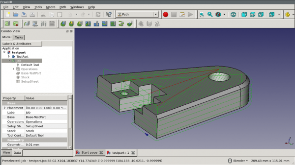
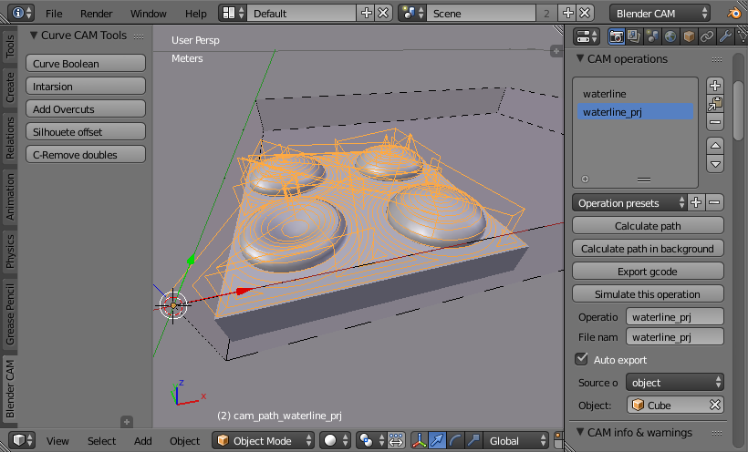
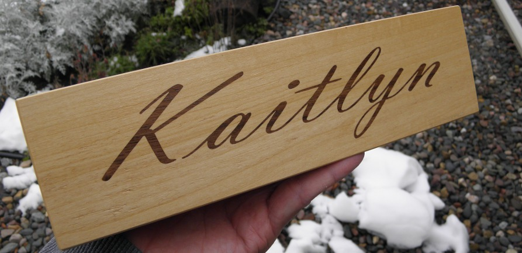
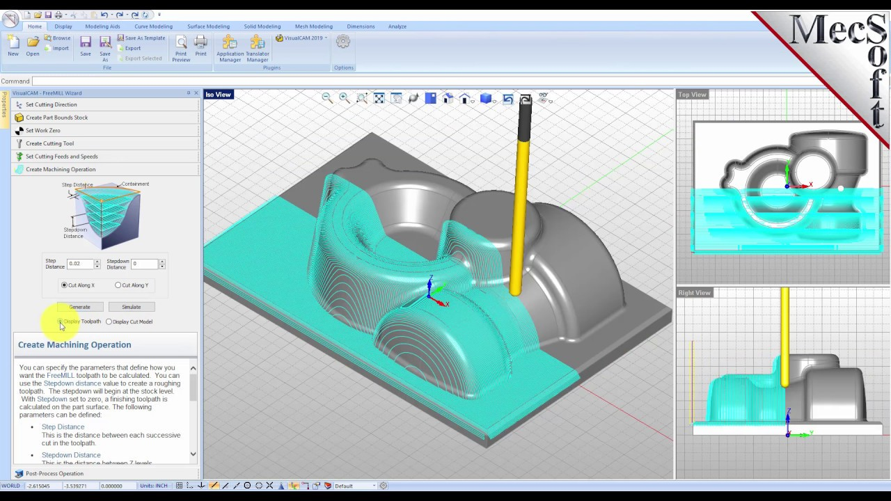
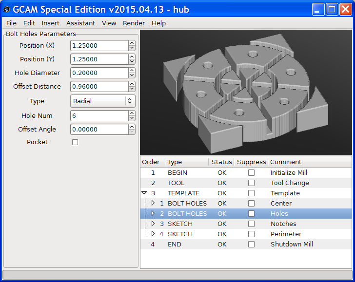
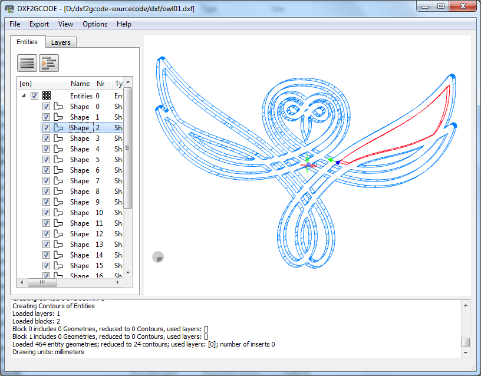

## CAM Tools to generate G-Code
[TOC]
### Browser based
#### jscut
2D :heavy_check_mark:, 2.5D :heavy_check_mark:, 3D :x:
[jscut site](http://jscut.org/)
[jscut Github repository](https://github.com/tbfleming/jscut)

#### Kiri:Moto
Kiri:Motor is an all around tool you can use for 3D printing, CNC toolpath generation and Laser cutting & stacking.
[Site](https://grid.space/kiri/)
[Github repository](https://github.com/GridSpace/grid-apps)
[tutorials](https://www.youtube.com/c/gridspace)

#### LaserWeb / CNCWeb
[Site](https://laserweb.yurl.ch/)
[Demo](https://laserweb.github.io/LaserWeb4/)

#### OpenBuilds CAM
[Site](https://cam.openbuilds.com)

#### Easel
Login is required for this one.
[Site](https://easel.inventables.com/users/sign_in)

https://github.com/ryannining/karyacnc

### Application based

#### Pycam
[pycam site](http://pycam.sourceforge.net/)
[pycam Github repository](https://github.com/SebKuzminsky/pycam/edit/master/docs/index.md)

#### FreeCAD Path Workbench
[Site](https://wiki.freecadweb.org/Path_Workbench)

#### Blender CAM
[Github](https://github.com/vilemduha/blendercam/wiki)

#### Heeks CAM
[Github](https://github.com/danheeks/HeeksCAM)

#### Carbide create

#### f-engrave
Could be used to generate wooden inlays or do v-carvings.

[Site](https://www.scorchworks.com/Fengrave/fengrave.html)

#### VisuCAMTest 
[Site](http://nraynaud.github.io/webgcode/webapp/visucamTest.html#/)

#### FreeMill
Should work with Wine
[Site](https://mecsoft.com/free-cad-cam/)

#### GCAM
[Site](https://github.com/blinkenlight/GCAM/wiki)

#### dxf2gcode
[Site](https://sourceforge.net/projects/dxf2gcode/)

#### FlatCAM
For milling PCB's
[Site](http://flatcam.org/)

### to be looked at
http://cnc-toolkit.com/
https://www.reddit.com/r/CNC/comments/aizatc/free_and_open_source_camcnc_software/
https://github.com/openscad/openscad/issues/2299

https://icesl.loria.fr/
makercad...?

topografic

https://github.com/TanayGahlot/ToolpathGenerator
