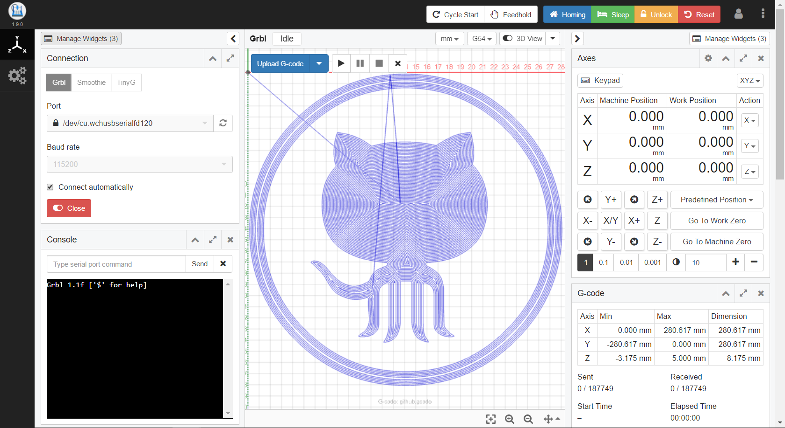
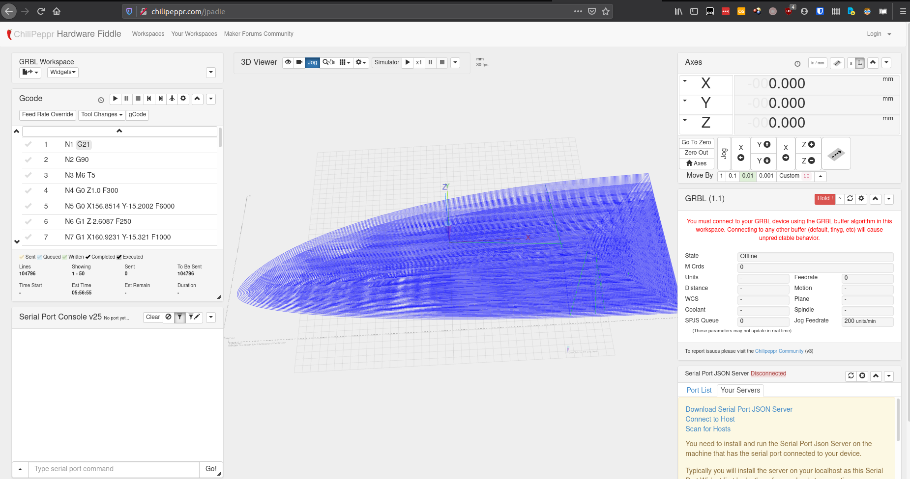

## CNC Controllers
[TOC]
### GCODE SENDERS
https://github.com/winder/Universal-G-Code-Sender
https://github.com/Denvi/Candle

#### bCNC
[Github](https://github.com/vlachoudis/bCNC)

#### Browser Based
##### CNCJS
https://cnc.js.org/
[Github](https://github.com/cncjs/cncjs)

##### Openbuilds control
[Github](https://github.com/OpenBuilds/OpenBuilds-CONTROL)
![]

##### Chilipeppr
[Site](http://chilipeppr.com)

### Linux CNC

### Octoprint

https://wiki.shapeoko.com/index.php/Communication_/_Control

https://github.com/ryannining/karyacnc

https://reprap.org/wiki/List_of_Firmware

https://www.reddit.com/r/CNC/comments/aizatc/free_and_open_source_camcnc_software/