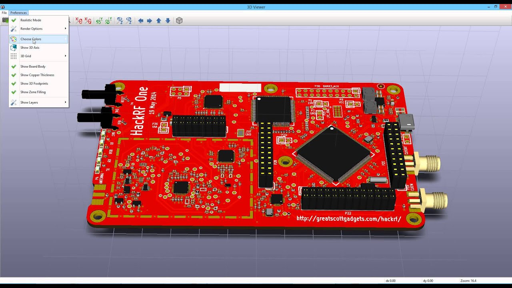
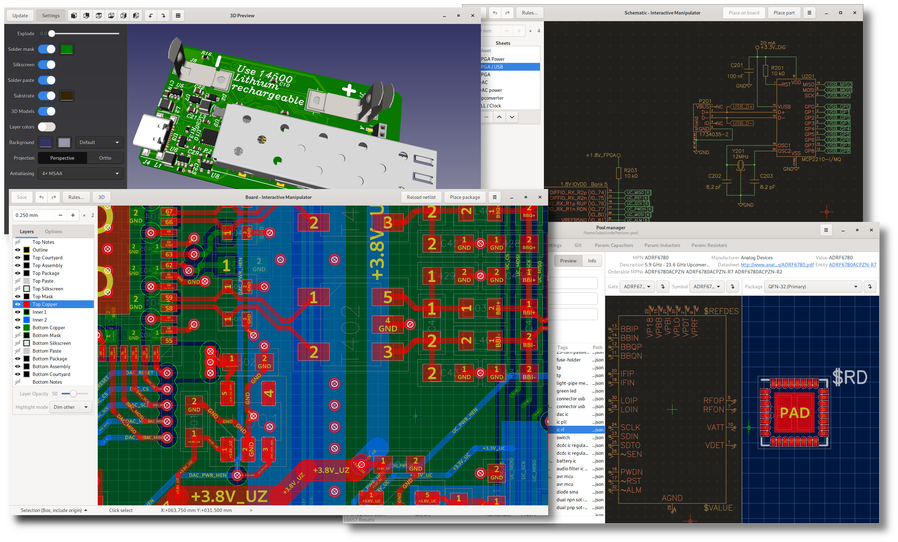
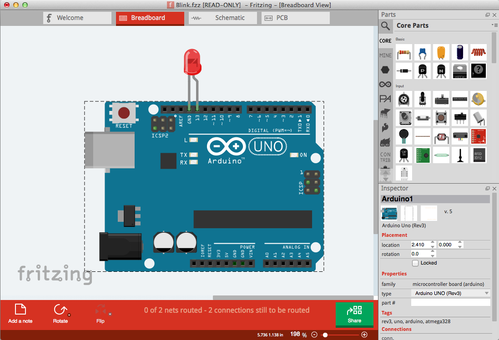

# Electronics
## Design
### KiCAD
[Site](https://kicad-pcb.org/)
[Gitlab](https://gitlab.com/kicad/code/kicad)

### LibrePCB
[Site](https://librepcb.org/)
[Github](https://github.com/LibrePCB/LibrePCB)

### Horizon
[Github](https://github.com/horizon-eda/horizon)

### Fritzing
[Site](https://fritzing.org/home/)
[Github](https://github.com/fritzing/fritzing-app)

### gEDA
[Site](http://www.geda-project.org/)

## Simulation
### QUCS

### SPICE

### Falstad/circuit

## To be added
https://www.reddit.com/r/electronics/comments/ap6m45/curated_list_of_awesome_free_and_open_source/
