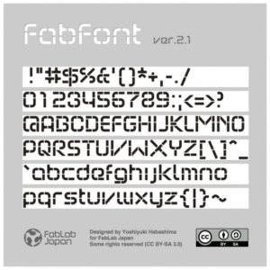
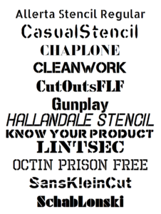
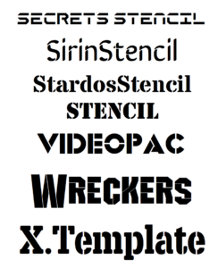

# Fonts for making

## National Park Type face
A TYPEFACE DESIGNED TO MIMIC THE NATIONAL PARK SERVICE SIGNS THAT ARE CARVED USING A ROUTER BIT.
[site](https://nationalparktypeface.com/)

## FabFont
[Download](Fonts/FabFont.ttf)
[Source](https://fabble.cc/hbsm/fabfont/)

## FabLab+ pack
[Download](Fonts/fonts_lasercut_set_01.zip)

