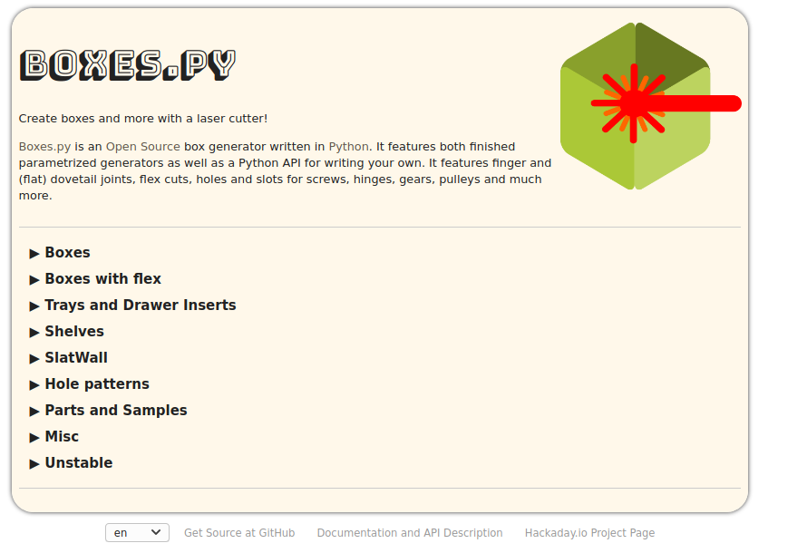
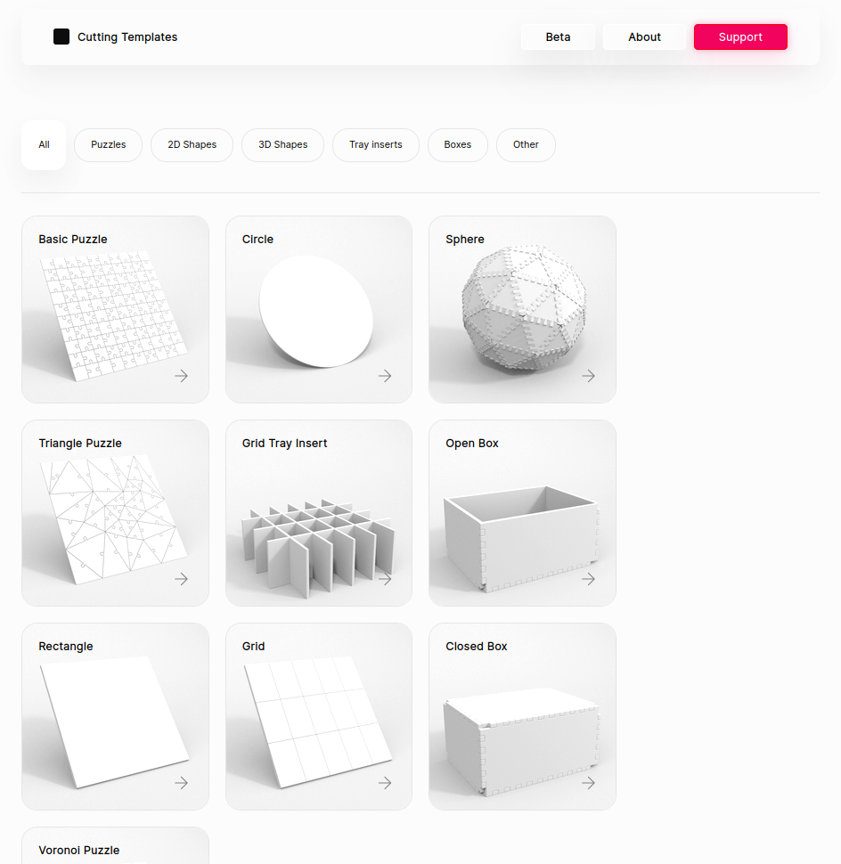
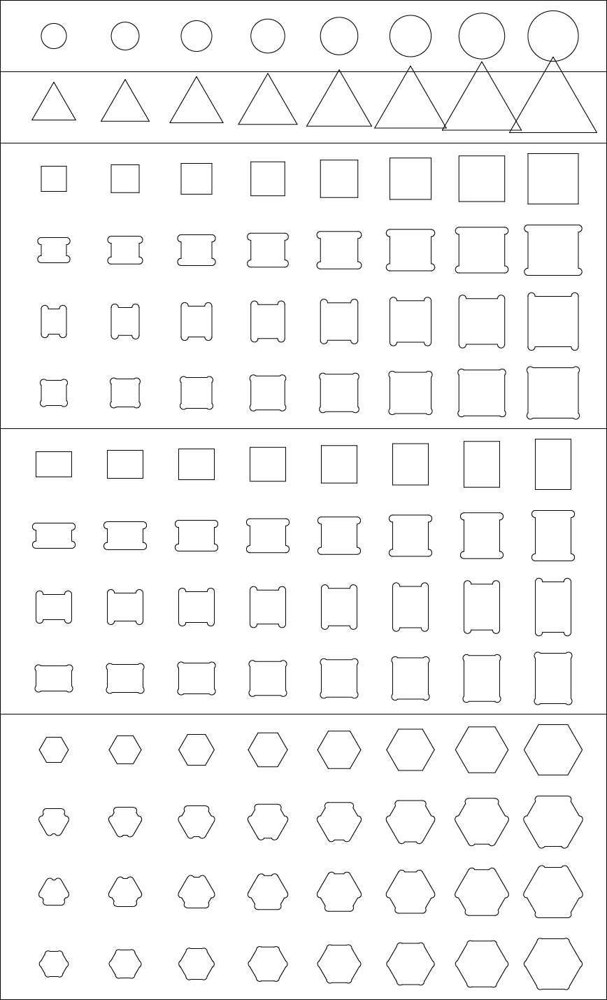

## SVG / DXF Generators
[TOC]
### Gear generators
* [geargenerator.com](https://geargenerator.com/)
### Box generators
#### Boxes.py
This site has a lot of generators for: (flex) Boxes, Trays, Drawers, Shelves, Hole patterns, Misc
[Site](https://www.festi.info/boxes.py/)
[Github](https://github.com/florianfesti/boxes)

### General
#### cutting templates

[Site](https://cuttingtemplates.com/)

#### Tolliver 
Is a hole generator to find the right fit and tolerance for your machine.
[Site](https://castirony.github.io/tolliver/)
[Github](https://github.com/CastIrony/tolliver)

#### Topological 3D Surface Data
- http://jthatch.com/Terrain2STL/
- https://opentopography.org/

